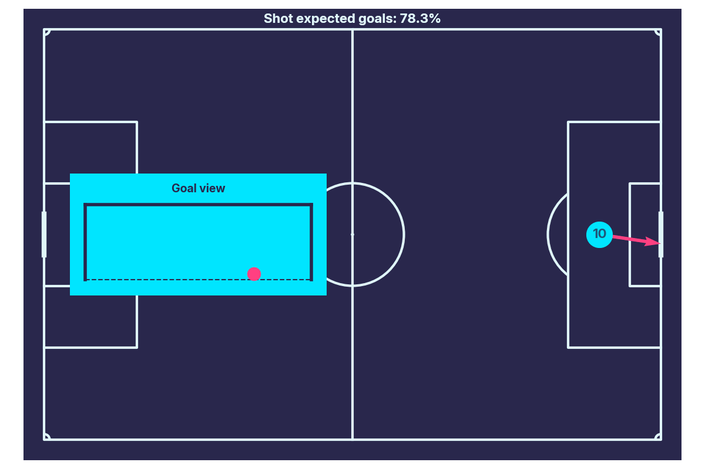

# messi-on-this-day-bot

Code for **MessiOnThisDay** [Twitter bot](https://x.com/OnThisDayMessi).

**MessiOnThisDay** is a bot that uses Statsbomb open data to create dynamic visualizations of all off Messi's goals. These visualizations will be posted on Twitter on the exact date and time they were scored years ago.

Steps to create this app:
1. Extract data for all Messi goals from Statsbomb open data [Notebook](./find_messi_goals.ipynb)
2. Create functions that generate the goals [GIF](./goal_plot.py) and [tweet](./goal_tweet.py)
3. Deploy [bot](./messi_bot.py) that checks, every minute, if Messi scored a goal at that precise time. The bot then generates a GIF and a tweet that is then published on Twitter

> The bot is currently hosted on [Render](https://render.com/) and the cronjob is running in [cron-job.org](https://cron-job.org/)

Tools and technologies used:
* Python: Core programming language and backend logic
* Matplotlib & Seaborn: Data visualization
* Statsbomb and Twitter APIs
* Flask

### Sample GIFs
1. vs Manchester United in the 2009 Campions League Final

2. vs Manchester United in the 2011 Campions League Final

3. vs France in the 2022 World Cup Final (first goal)

4. vs France in the 2022 World Cup Final (second goal)
